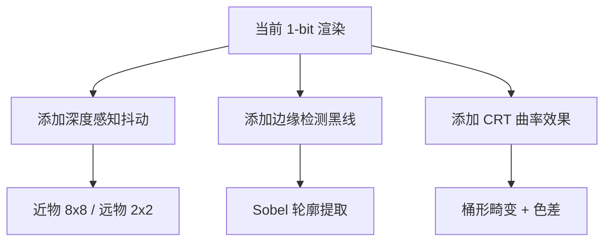

# 1-Bit 风格游戏优化建议

> **项目**: Wired Brutalism: Chimera Void  
> **分析日期**: 2025-12-21

---

## 📊 项目现状概述

当前项目已经具备了一个完整的 1-bit 抖动渲染系统：

- **4x4 Bayer 抖动矩阵** - 将所有颜色压缩为黑白二元
- **CRT 扫描线叠加** - 模拟老式显示器效果
- **程序化生成世界** - 4种建筑风格 (TREE/SPIKES/BLOCKS/FLUID)
- **动态线缆系统** - 带脉冲动画
- **手持发光花朵** - 作为唯一的光源符号

---

## 🎨 视觉优化建议

### 1. 增强 1-Bit 抖动效果的层次感

#### 1.1 动态抖动矩阵尺寸

```glsl
// 建议: 根据距离切换不同大小的抖动矩阵
// 近处使用 8x8 矩阵获得更细腻的过渡
// 远处使用 2x2 矩阵强调1-bit块状感

float bayer8x8(vec2 uv);  // 更精细的渐变
float bayer2x2(vec2 uv);  // 更粗糙的块状感

// 根据深度混合
float depth = texture2D(tDepth, vUv).r;
float threshold = mix(bayer8x8(pixelCoord), bayer2x2(pixelCoord), depth);
```

> [!TIP]
> 这会让近处物体有更柔和的抖动，远处物体更加"数字化"、更 blocky，增强经典 1-bit 的审美。

#### 1.2 添加蓝噪声抖动选项

经典 1-bit 游戏（如 Mac 时代的游戏）有时使用蓝噪声来代替 Bayer 矩阵，产生更"自然"的抖动。可以考虑添加一个切换选项：

```glsl
uniform int ditherMode; // 0: Bayer, 1: BlueNoise, 2: Random

// BlueNoise dithering 更接近 Mac 经典游戏的感觉
float blueNoise = texture2D(tBlueNoise, vUv * resolution / 64.0).r;
```

---

### 2. 强化经典 1-Bit 游戏的视觉语言

#### 2.1 添加边缘检测 (Outline) 效果

1-bit 美学的一个标志性特征是 **粗黑边线** (类似漫画/木刻)：

```glsl
// Sobel 边缘检测后叠加黑边
vec4 outlineColor = vec4(0.0);
float edge = sobelEdge(tDiffuse, vUv, resolution);
if (edge > 0.5) {
    finalColor = vec3(0.0); // 强制黑边
}
```

> [!IMPORTANT]
> 这会让建筑和物体的轮廓更加清晰，增强 1-bit 的"版画"感。

#### 2.2 Halftone (半色调网点) 模式

除了 Bayer/BlueNoise，可以添加一个 **圆点半色调** 模式，模拟报纸印刷效果：

```glsl
// Circular halftone pattern
float halftone(vec2 uv, float gray) {
    vec2 cell = floor(uv * 20.0); // 网点密度
    vec2 center = (cell + 0.5) / 20.0;
    float dist = distance(uv, center);
    float radius = gray * 0.5; // 灰度控制圆点大小
    return dist < radius ? 1.0 : 0.0;
}
```

---

### 3. 增强 CRT/复古显示效果

#### 3.1 屏幕曲率 (Barrel Distortion)

```glsl
// 桶形畸变模拟 CRT 屏幕曲面
vec2 barrelDistortion(vec2 uv) {
    vec2 cc = uv - 0.5;
    float dist = dot(cc, cc);
    return uv + cc * dist * 0.1; // 畸变强度
}
```

#### 3.2 VHS 噪点/信号干扰

添加偶尔的 **水平条纹故障** 和 **色彩偏移**：

```css
/* CSS 层面的故障效果 */
@keyframes glitch {
    0%, 100% { transform: translate(0); }
    25% { transform: translate(-2px, 0); filter: brightness(1.2); }
    75% { transform: translate(2px, 0); filter: brightness(0.8); }
}

#scanlines::before {
    animation: glitch 0.1s infinite;
}
```

> [!NOTE]
> 考虑用 shader 实现更精细的故障效果，例如随机的水平位移和信号丢帧。

---

### 4. 改进天空之眼 (Sky Eye)

#### 4.1 添加眨眼动画

让天空之眼偶尔"眨眼"，增加诡异感：

```javascript
// 随机触发眨眼
if (Math.random() > 0.999) {
    skyEyeGroup.scale.y = 0.1; // 压扁 = 闭眼
    setTimeout(() => skyEyeGroup.scale.y = 1.0, 100);
}
```

#### 4.2 瞳孔追踪玩家

```javascript
// 瞳孔始终注视玩家位置
const pupil = skyEyeGroup.children[4]; // 假设瞳孔是最后一个元素
const eyeDir = camera.position.clone().sub(skyEyeGroup.position).normalize();
pupil.position.lerp(eyeDir.multiplyScalar(2), 0.05);
```

---

## 🎮 游戏机制优化建议

### 1. 环境交互

#### 1.1 花朵与环境的光照互动

目前花朵是唯一持续光源，可以让这个光源与环境产生更多互动：

- **花朵靠近建筑时** → 建筑局部变亮
- **花朵在 FLUID 建筑附近** → 液体反射光芒
- **花朵在黑暗区域** → 增加安全区域的感觉

```javascript
// 检测花朵附近的物体，动态调整其材质亮度
const flowerPos = flower.getWorldPosition(new THREE.Vector3());
scene.traverse(obj => {
    if (obj.isMesh && obj.position.distanceTo(flowerPos) < 5) {
        obj.material.emissiveIntensity = 0.3;
    }
});
```

#### 1.2 添加声音反馈

1-bit 风格游戏（如早期 Mac 游戏）通常有 **标志性的 8-bit 音效**：

- 行走时的脚步声 (节奏化的白噪声)
- 靠近建筑时的低频嗡嗡声
- 线缆脉冲的电流声
- 天空之眼的"凝视"警告音

> [!TIP]
> 使用 Web Audio API 生成程序化音效，以配合 1-bit 美学。

---

### 2. 探索与发现机制

#### 2.1 隐藏元素

添加可发现的隐藏物品或区域：

- **发光的符文** - 只在特定角度可见
- **隐藏洞穴** - 在 TREE 建筑根部
- **漂浮的古老符号** - 在高空中旋转

#### 2.2 目标收集系统

```javascript
// 在区块中随机生成可收集的发光球体
if (hash(cx, cz) > 0.95) {
    const collectible = new THREE.Mesh(
        new THREE.DodecahedronGeometry(1),
        new THREE.MeshBasicMaterial({ color: 0xffffff })
    );
    collectible.userData.isCollectible = true;
    chunk.add(collectible);
}
```

---

### 3. 节奏与氛围

#### 3.1 昼夜循环 (1-bit 风格)

在 1-bit 中模拟昼夜：

- **日间** → 背景白色，建筑黑色
- **夜间** → 背景黑色，建筑白色 (反转!)

```javascript
// 每5分钟切换一次
const dayNightCycle = Math.sin(time * 0.01) > 0;
scene.background.setHex(dayNightCycle ? 0x888888 : 0x111111);
DitherShader.uniforms.invert.value = !dayNightCycle;
```

> [!CAUTION]
> 反转效果可能需要调整光照强度，确保可见性。

#### 3.2 天气系统

- **静态噪点** - 模拟电子雪花干扰
- **垂直线条** - 模拟"信号不良"的下雨效果
- **渐变亮度** - 模拟云层遮盖

---

## 🖼️ 经典 1-Bit 参考与灵感

### 历史参考

| 游戏/项目 | 特征 |
|----------|------|
| **Obra Dinn** | 4色调色板 + 粗糙抖动 |
| **Classic Mac Games** | 蓝噪声 + 精细边缘 |
| **Pico-8 游戏** | 强烈的像素边界 |
| **黑白漫画风格** | 笔触纹理 + 高对比度 |

### 建议的视觉增强



---

## 🚀 优先级建议

### 高优先级 (视觉冲击力)

1. **边缘检测轮廓线** - 强化 1-bit 版画感
2. **深度感知抖动** - 增加空间层次
3. **天空之眼互动** - 增加神秘氛围

### 中优先级 (氛围增强)

4. **程序化音效** - 8-bit 风格声音
5. **昼夜循环反转** - 动态视觉变化
6. **CRT 曲率模拟** - 复古显示器感

### 低优先级 (长期目标)

7. **收集系统** - 探索动机
8. **天气系统** - 环境多样性
9. **隐藏区域** - 重复游玩价值

---

## 💡 技术实现备注

### 着色器扩展建议

```glsl
// 完整的增强型 1-bit 着色器结构
uniform int ditherType;     // 0: Bayer, 1: BlueNoise, 2: Halftone
uniform bool enableOutline;
uniform float barrelAmount;
uniform bool invertColors;

void main() {
    vec2 uv = vUv;
    
    // 1. CRT 曲率
    if (barrelAmount > 0.0) uv = barrelDistortion(uv);
    
    // 2. 采样颜色
    vec4 color = texture2D(tDiffuse, uv);
    float gray = dot(color.rgb, vec3(0.299, 0.587, 0.114));
    
    // 3. 边缘检测
    float edge = enableOutline ? sobelEdge(tDiffuse, uv) : 0.0;
    
    // 4. 抖动
    float threshold = getDitherThreshold(ditherType, gl_FragCoord.xy);
    vec3 result = gray < threshold ? vec3(0.0) : vec3(1.0);
    
    // 5. 叠加边缘 (黑)
    if (edge > 0.3) result = vec3(0.0);
    
    // 6. 反转 (夜间模式)
    if (invertColors) result = vec3(1.0) - result;
    
    gl_FragColor = vec4(result, 1.0);
}
```

---

*以上建议旨在保持并强化项目独特的 1-bit 美学，同时增加探索深度和视觉多样性。*
